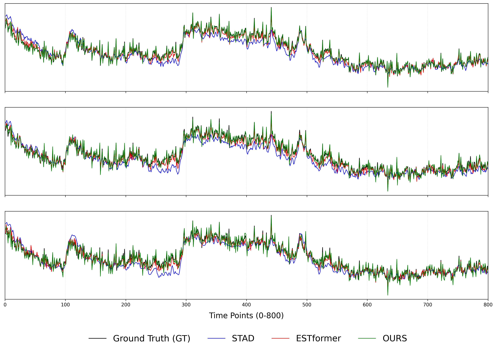
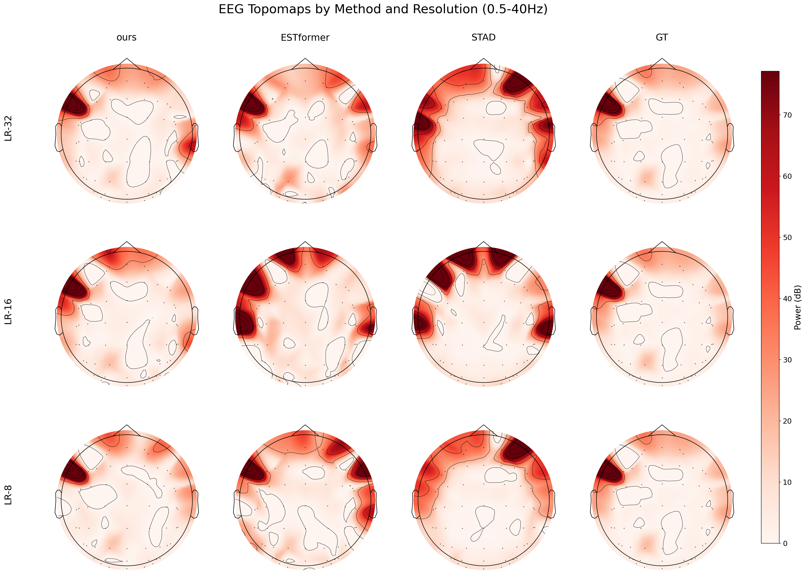

# Process-Informed Conditional Diffusion Model for EEG Super-Resolution with Temporal Fidelity and Spatial Coherence

<p align="center">





</p>

Figure 1: Comparison of Method Architecture and Experimental Results​​

​​Left: Reconstructed EEG Data from SEED Dataset | Right: Topographic Map Visualization for SEED Dataset​

## :wrench: Dependencies and Installation

### System Requirements
- Python >= 3.8 (Tested with Python 3.11.7)
- PyTorch >= 1.10 (Tested with PyTorch 2.1.2+cu118)
- CUDA >= 11.8 (Recommended for GPU acceleration)
- Linux (Recommended)

### Installation
1. Clone repository:
   ```bash
   git clone https://github.com/yourusername/yourproject.git
   cd yourproject
   ```

2. Create and activate conda environment:
   ```bash
   conda create -n eegsr python=3.11.7
   conda activate eegsr
   ```

3. Install dependencies:
   ```bash
   pip install -r requirements.txt
   ```

## :computer: Training

### Dataset Preparation
1. Download datasets:
   - SEED: http://bcmi.sjtu.edu.cn/~seed
   - SEED-IV: http://bcmi.sjtu.edu.cn/~seed/seed-iv.html
   - Localize-MI: https://doi.org/10.12751/g-node.1cc1a

2. Run data verification script:
   ```bash
   python checkdata.py
   ```

### Training Workflow
The training process consists of four sequential steps:

1. Train autoencoder:
   ```bash
   python train_autoencoder.py
   ```

2. Train convolutional network:
   ```bash
   python train_conv_new.py
   ```

3. Train DDPM model:
   ```bash
   python train_DDPM_res_conv_small.py
   ```

4. Finetune decoder:
   ```bash
   python fintune_decoder.py
   ```

### Optional: Extract Latent Space Data
After step 1 (training autoencoder), you can extract latent space data:
```bash
python autoencoder_get_data_zhiding.py
```

### Evaluation
After training, run the evaluation notebook:
```bash
jupyter notebook test_data.ipynb
```

### :gear: Configuration
The main configuration file is `config.yaml`.
